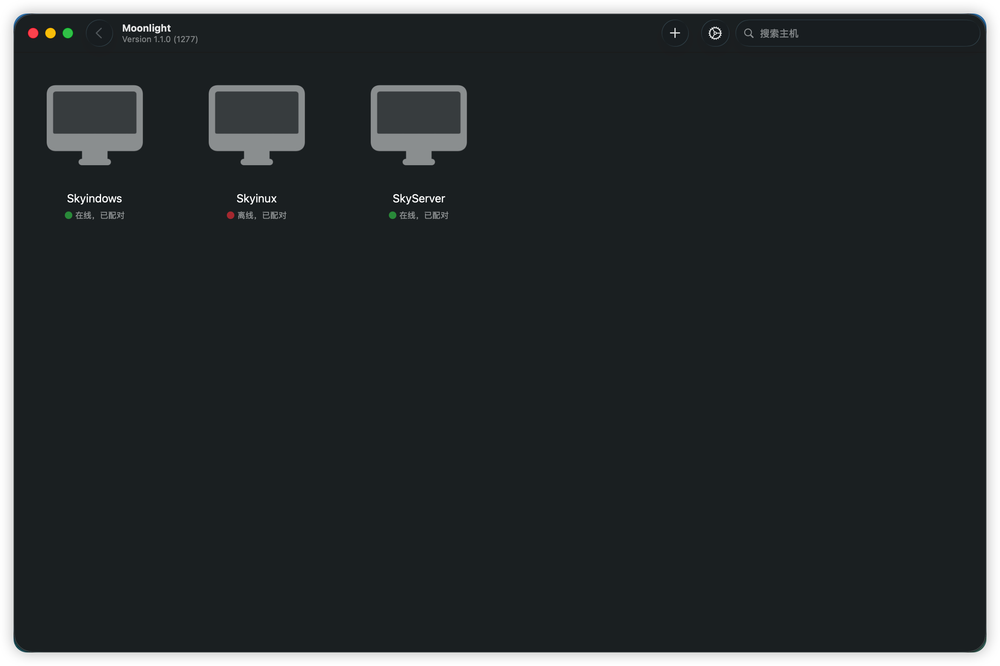
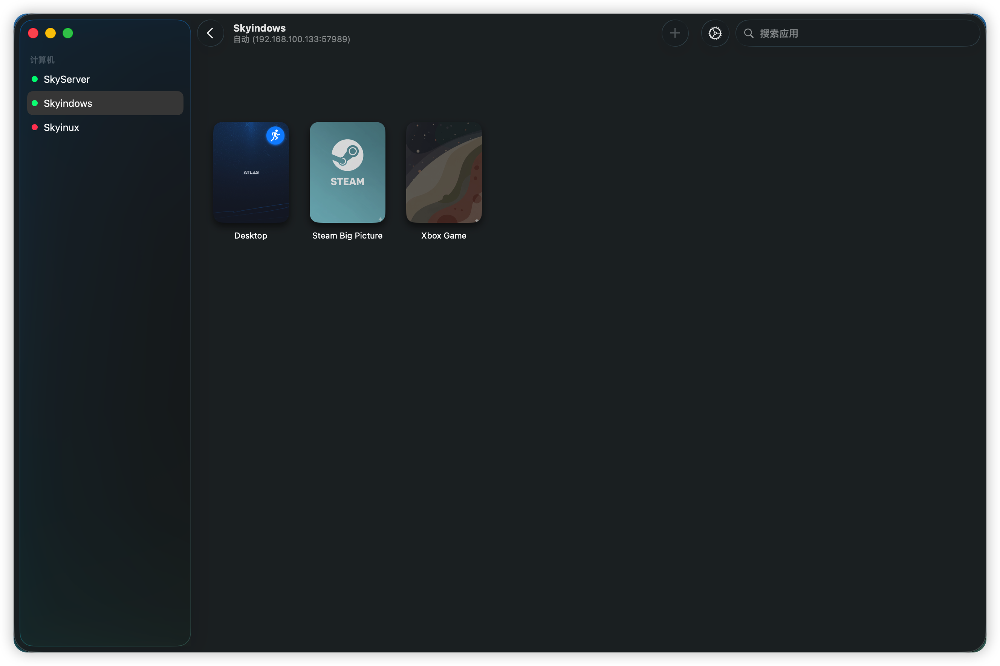
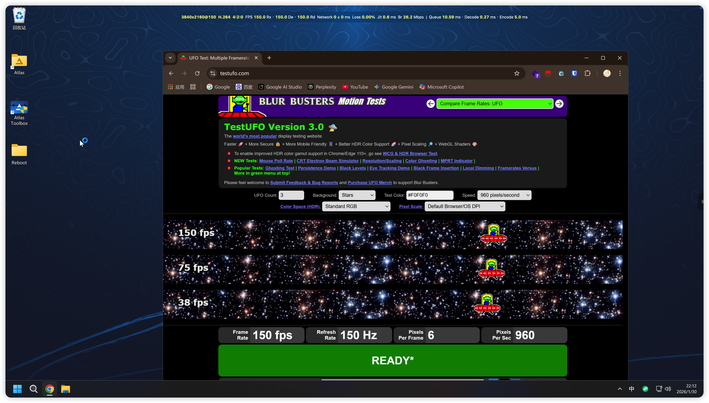
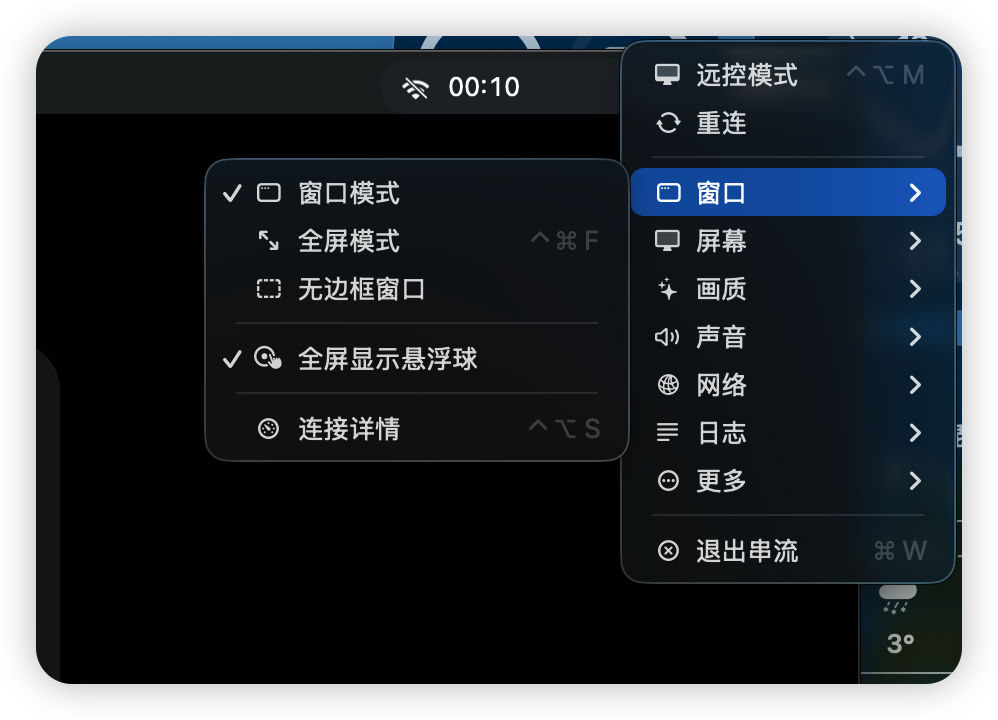
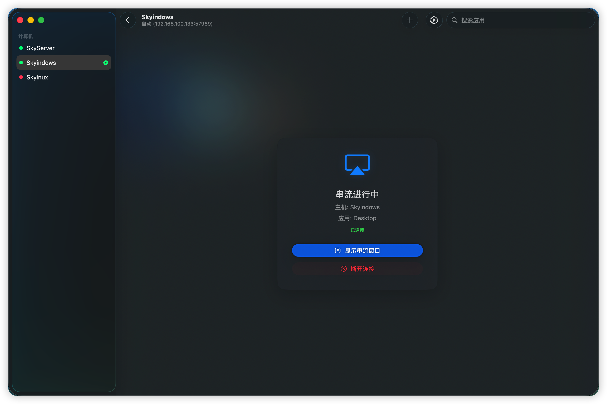
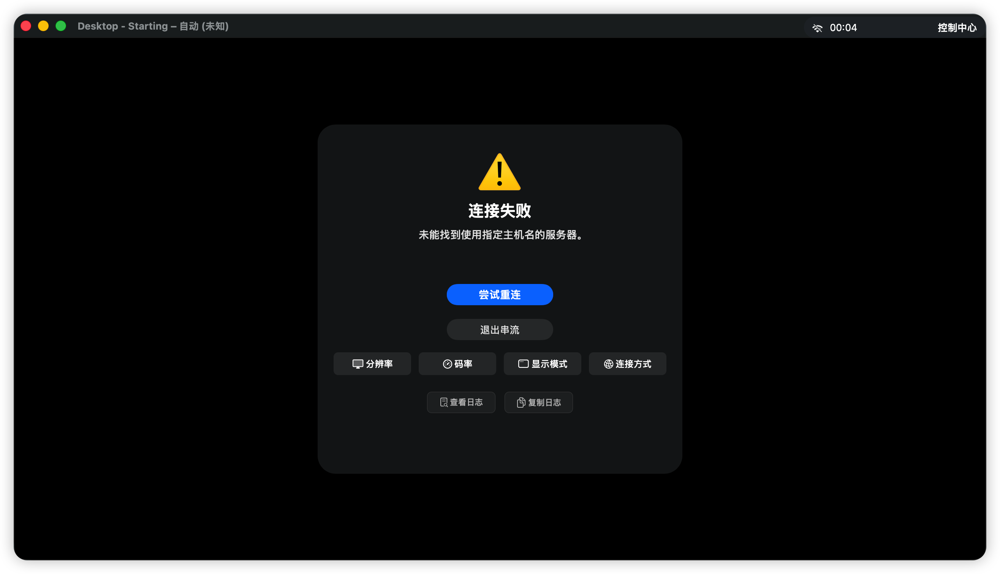

# Moonlight for macOS — Enhanced Edition

[](https://github.com/opsbsligm/moonlight-macos-enhanced/actions/workflows/build.yml)
[](https://github.com/opsbsligm/moonlight-macos-enhanced/releases/latest)
[](https://github.com/opsbsligm/moonlight-macos-enhanced/releases)
[](https://developer.apple.com/macos/)
[](LICENSE)

A fork of [skyhua0224/moonlight-macos-enhanced](https://github.com/skyhua0224/moonlight-macos-enhanced), which itself derives from the [Moonlight Game Streaming Project](https://github.com/moonlight-stream).

**What differs from upstream, in one line**: keyboard and mouse input follow the same industrial-standard mapping used by Parsec, UU Remote and Steam Link, and that mapping is testable and diagnosable. Everything else — codecs, HDR, audio, controllers — comes from upstream. The mapping table, the design rules and the root causes behind the fixed issues are in [`docs/input-mapping-design.md`](docs/input-mapping-design.md); the head-to-head comparison is in [`docs/input-mapping-benchmark.md`](docs/input-mapping-benchmark.md).

## What it does

- GameStream / Sunshine host discovery and pairing
- H.265/HEVC and AV1 hardware decoding
- HDR, with a choice of HDR→SDR tone-mapping strategies (including a `No Exposure Shift` option)
- Multi-channel audio plus microphone streaming
- Virtual Xbox 360 controller, with device-identification fixes for Xbox Elite 2 and Betop Zeus pads
- Core HID high-precision mouse input, in both locked and free-pointer modes
- **A streaming control bar docked on one screen edge**: a handle that stays visible at the edge (14×48 points while idle) and can be dragged to any of the four edges. In free-pointer or explicitly released mode a local pointer dwelling 12pt inward for 250ms only *lights the handle* - the game keeps the pointer and nothing opens - and **clicking the lit handle** is what expands the bar, against the same rectangle that was drawn. **In locked game mode there is no local pointer to hover and the remote cursor position is never guessed** — there the open-control-center shortcut (`⌃⌥C` by default) always opens the sidebar and closes it again on the next press (never while the handle is being dragged), and the release-mouse shortcut hands the pointer back so the handle can be lit and clicked like any other arrival. Nothing at the edge opens the bar on its own while locked: the two-flick gesture that once stood in for arrival completed during ordinary aiming and took the pointer out of the game every time, so it is deleted rather than retuned. A bar whose handle the pointer never reached returns the pointer to the game after about 2500ms; once the pointer has been on it, it collapses 450ms after leaving. Detection is in local pointer and window points, never scaled by stream resolution (entry design, pointer ownership and field evidence in [`docs/edge-sidebar-locked-entry-2026-09-28.md`](docs/edge-sidebar-locked-entry-2026-09-28.md))
- A live performance overlay, plus the real state of the video pipeline — whether MetalFX and VideoToolbox frame interpolation actually took effect
- Chinese and English interfaces: menus, permission prompts and the log panel are all localised
- **A devices pane**: lists what is on the local USB bus, attributes each device to a specific reason (reserved class / local input device / no matching rule / precondition unmet), reports whether *this* build's signature could load a driver extension at all, and reads the host's claim as one of four answers — offered, refused, unreachable, or never asked. `unreachable` is deliberately not a refusal: no route, an error status, or an answer signed by a different machine all land there, and calling it a refusal would be reporting a decision nobody heard.

## Host compatibility

| Host software | Compatibility | Notes |
|---------------|---------------|-------|
| [Foundation Sunshine](https://github.com/qiin2333/foundation-sunshine) | ⭐ Recommended | Best support for microphone uplink, YUV 4:4:4, multi-channel audio and two-way clipboard for text and single images |
| [Sunshine (LizardByte)](https://github.com/LizardByte/Sunshine) | ✅ Supported | Most features work; some advanced paths are limited |
| GeForce Experience | ⚠️ Basic | Deprecated, and missing newer features such as microphone uplink |

## What it does not do yet

- **No USB device redirection.** The devices pane diagnoses only. Redirection still needs a Developer ID signature and a host-side virtual bus, and neither is in place, so it promises no handover will succeed. The trade-off is in [`docs/usb-redirection-design.md`](docs/usb-redirection-design.md) and the host side would have to agree to [`docs/usb-redirection-host-contract.md`](docs/usb-redirection-host-contract.md).
- **macOS 26.0 or newer at runtime.** `MACOSX_DEPLOYMENT_TARGET = 26.0`, because the Liquid Glass window layer needs it. What supporting macOS 15/12 would take (upstream issue #26) is in [`docs/contributing.md`](docs/contributing.md).
- **Every build carries an install step.** These builds are ad-hoc signed, so the first launch needs an allowance under System Settings → Privacy & Security.

## Download and install

1. Take the newest image from [Releases](https://github.com/opsbsligm/moonlight-macos-enhanced/releases/latest): `Moonlight-macOS-Enhanced-{arm64,x86_64,universal}.dmg`, each with a matching `.sha256`. Images are named per architecture rather than per version — the version is checked inside the image against the build number CI computed, not against a filename. If you are unsure, take `universal`.
2. Open the DMG and drag `MoonlightEnhanced.app` into Applications. In Finder, the Dock and the Force Quit list it appears as 「Moonlight 增强版」.
3. On first launch, allow it under System Settings → Privacy & Security.

> ℹ️ This build installs as `MoonlightEnhanced.app`, so it no longer replaces the Qt client's `Moonlight.app` (issue #41) and the two can live side by side. If `/Applications` still holds a `Moonlight.app` installed by an earlier build of *this* repository, delete it first: both carry the same bundle identifier (`std.skyhua.MoonlightMac2`), so LaunchServices may keep launching the stale copy and the permissions follow the old path.

## Building from source

```bash
git clone --recurse-submodules <repo-url>
cd moonlight-macos-enhanced
scripts/download-frameworks.sh   # FFmpeg / SDL2 / OpenSSL — required before the first build
scripts/build.sh
scripts/package-dmg.sh
```

Skipping `download-frameworks.sh` makes common-c fail to compile, because `libs/` is gitignored by design. Xcode and deployment-target requirements are in [`docs/contributing.md`](docs/contributing.md).

## Reporting a problem

**Copy the diagnostics report first.** `Settings → App → Debug Log → Copy Diagnostics Report…` puts a paste-ready report on the clipboard, and the pairing-failure popup carries the same button. If a mouse stopped moving, turn on `Settings → App → Debug Log → Input Diagnostics`, reproduce once, then copy — the switch has to be on during the reproduction, because the ledger records the session that was being watched.

Then add: which host software and version (Sunshine or GeForce Experience), whether Mos / BetterMouse / SteerMouse or another pointer utility is running, and the steps you took next to what you expected. What the report contains, why the switch comes first, and what is redacted before anything leaves the machine is in [`docs/diagnostics-report.md`](docs/diagnostics-report.md).

## Documentation

[`docs/README.md`](docs/README.md) indexes every document by reader, and [`docs/contributing.md`](docs/contributing.md) covers the gates — each one ships with a self-test, because a gate that has never failed is not evidence. Per-release detail with root causes is in [`CHANGELOG.md`](CHANGELOG.md), and the content archived off this page is in [`docs/history/rounds.md`](docs/history/rounds.md).

> Written in English: `input-mapping-benchmark.md`, `upstream-issue-status.md`,
> `windows-auto-signin-design.md`. Written in Chinese: `docs/README.md` and
> `contributing.md`, `diagnostics-report.md`, `input-mapping-design.md` and the two
> `usb-redirection-*.md` documents. A translation pull request for that second group would
> be genuinely welcome rather than politely declined.

## Screenshots

| Host list | App list |
|:---------:|:--------:|
|  |  |

| Performance overlay | Connection manager |
|:-------------------:|:------------------:|
|  |  |

| Streaming overlay | Connection error |
|:-----------------:|:----------------:|
|  |  |

## Contributing

Fork → feature branch → commit in [Conventional Commits](https://www.conventional-commits.org/) form → pull request. Gate list, commit types and the version/tag convention are in [`docs/contributing.md`](docs/contributing.md).

## Contact

- 📧 Email: [dev@sky-hua.xyz](mailto:dev@sky-hua.xyz)
- 💬 Telegram: [@skyhua](https://t.me/skyhua)
- 🐧 QQ: 2110591491
- 🐙 Issues: [skyhua0224/moonlight-macos-enhanced](https://github.com/skyhua0224/moonlight-macos-enhanced/issues)

## Acknowledgements

- [Moonlight Game Streaming Project](https://github.com/moonlight-stream) — the original upstream
- [skyhua0224/moonlight-macos-enhanced](https://github.com/skyhua0224/moonlight-macos-enhanced) — the author this fork came from
- [Parsec](https://parsec.app) — reference for keyboard-mapping practice
- Every contributor and test player

## License

GPL-3.0 — see [LICENSE](LICENSE). Bundled third-party components: moonlight-common-c (GPLv3), OpenSSL (Apache 2.0), FFmpeg (LGPLv2.1+), SDL2 (zlib), MASPreferences (BSD-2-Clause), Roboto Font (Apache 2.0).
